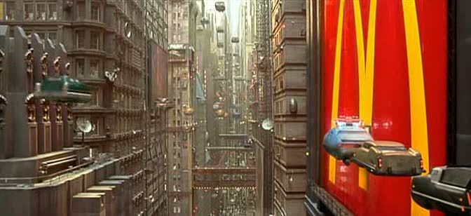
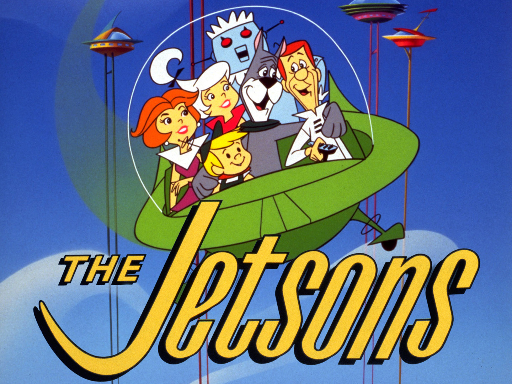
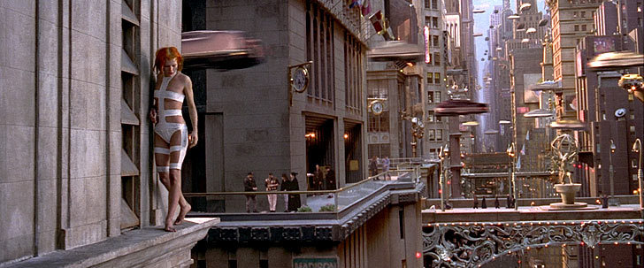
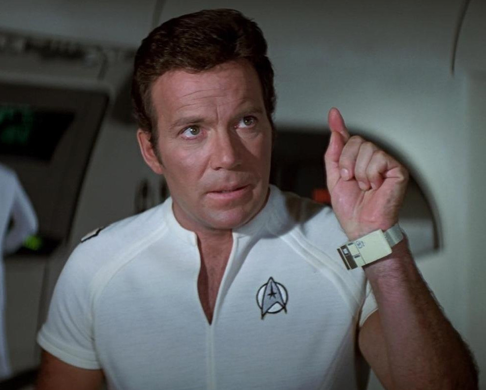
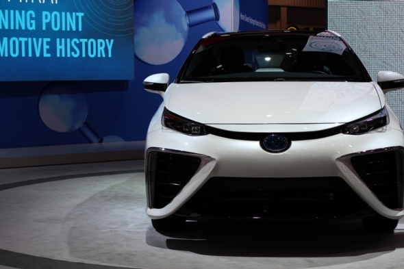
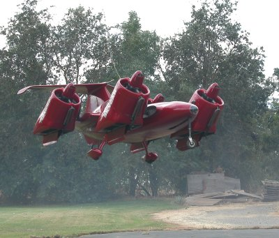
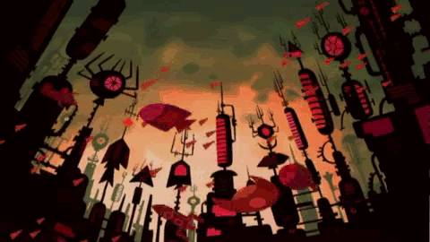
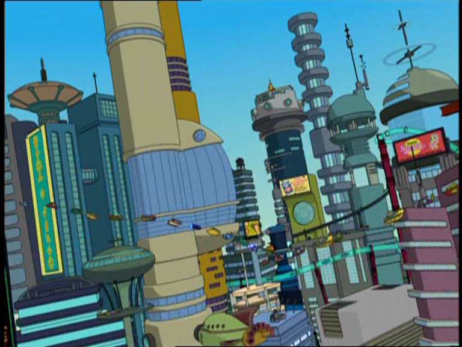
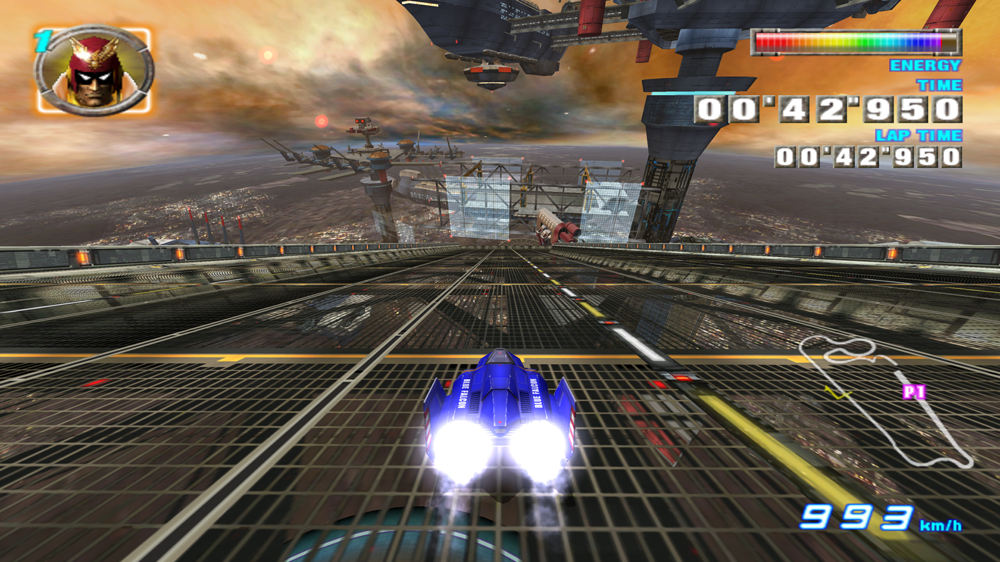
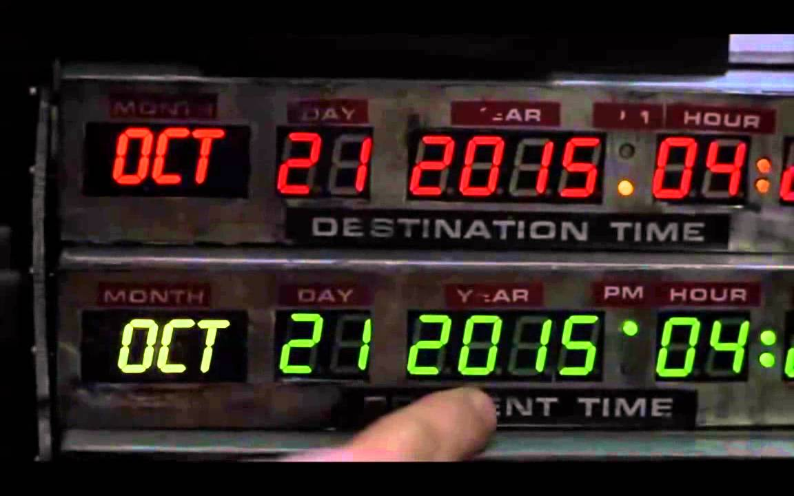

*[The Fifth Element](#12) takes place in New York City in the year 2263 [\[12\]](#12)*

# Art: The Blueprint of the Future

Nicholas Del Duca

For decades, media and technology have changed the landscape. In 1865, Jules Verne’s *From Earth to the Moon*, a projectile, containing three astronauts, is launched from the earth’s surface and sent to the moon. Sputnik was the first satellite to be sent into space, and that did not happen until 1957, and the moon landing did not occur until 1969, more than 100 years after Jules Verne’s novel predicted the feat. Another classic science fiction novel, Ray Bradbury’s [*Fahrenheit 451*](#1) talks about a society in which cars are being driven so fast, that billboards are hundreds of feet long and the people are all brainwashed by television and other media. [\[1\]](#1) Today, there are faster cars, larger advertisements, and a complete overload of mind numbing television. Bradbury also mentions the idea of a ‘headphone’ or ‘earbud’ style device that we see today. It isn’t just books predicting the future. Movies, television, and video games have also made a considerable impact. Their visual-based presentation makes it easier for consumers to visualize using the inventions.

*From Earth to the Moon, by Jules Verne*

## "Flying Car Syndrome" 

The most common invention used in all of science fiction is the flying car or personal aircraft. When studying science fiction, especially movies, since 1977’s *Star Wars* it is nearly impossible to avoid flying cars, or some kind of flying vehicle designed for person travel. The use of flying cars in media since the late 1970s is what I would call ‘Flying Car Syndrome’. Since there was an outbreak of these flying cars in television and movies, consumers started asking when, not if, flying cars would come to fruition. The media was so oversaturated with these vehicles, consumers and audiences understood them to be a part of the future. Often times, when something is set far in the future, but does not have flying cars, it is less realistic to many viewers.

*[The Jetsons](#4) featured flying cars and personal ships in the 1960s [\[4\]](#4)*

*The Jetsons* television series from 1962 was the first popular depiction of flying cars and personal ships. Another aspect seen in conjunction with flying vehicles, are incredibly tall buildings. Flying vehicles allow for more vertical building and more access to the air. Therefor, places where flying cars would be most useful are large cities with skyscrapers, such as New York City, as depicted in *Blade Runner* and in *The Fifth Element*. 

*A view of what a city's landscape could look like in the future* 

## Media of the Past, Tools of the Present

From Jules Verne’s spacecraft to *Star Trek* wrist mounted communication devices , the world has implemented many science fiction devices. It may only be a matter of time before the flying car makes its way into home garages -or landing pads I suppose. In 2016, the world is facing a great change when it comes to the automobile. Google’s self-driving cars are at the forefront. Although cars aren’t exactly airborne yet, this is a huge step towards that goal. There will still be quite some time until self-driving cars hit the road, as it was just announced on October 26, 2016  that 5 cities have been chosen to test the self-driving cars. Fuel-cell cars are another huge innovation being brought out in 2016. In 2015, Toyota announced the *Mirai*, the first ever commercial fuel-cell car. Although some stumbling blocks have been encountered, cars 

*[The Toyota Mirai](#9), a hydrogen powered car. [\[9\]](#9)*

## The Sprint Before Takeoff

*[The Moller Skycar](#8) 400 taking off [\[8\]](#8)*

Like an airplane taking off, we must first keep our wheels on the ground, and sprint ahead until we gather enough speed and momentum for us to take to the air. That is exactly what is happening right now. Dr. Paul Moller has been trying build a flying car for over 40 years. Moller’s Skycars are something to behold. The Skycar 400 has landing gear and retractable wings. There are Flight Simulator tests and videos, including real prototypes taking flight for brief periods of time. A unique feature that the Skycars have -other than being, you know, a flying car- is that it takes off vertically. Rather than picking up speed on a runway, the Skycar propels itself straight into the air, much like the modified, Flying Delorean in *Back to the Future*. Hopefully that is the invention that comes from *Back to the Future*, otherwise, we better get used to wearing whatever this is:

*Really though. Is that a helmet? Why?*

## What Does the Future Hold?

There is so much hope and potential for these cars to -quite literally- take off. However, there are many obstacles as well. In order to get a car that weighs upwards of two thousand pounds off the ground will require a lot of power. Jet fuel is also not exactly the cheapest commercial fuel on the market. Driving (piloting?) one of these flying cars would also be completely different than driving a regular car. There are tremendous safety hazards, even something as simple as parking a car could be life threatening. Without a highway system in the sky, accidents would be incredibly common. There needs to be strict air control and regulation at all times. If there isn’t some kind of highway system or roadways there is no way flying cars will ever be a reality. If everything looks like this:

Nobody would ever dare take to the sky. This would eliminate not only the idea of flying cars, but airplanes and helicopters would not take off into this crowded mess of a sky. Things need to mirror this example here:

Where there are orderly lines and clear paths for vehicles. I get it, traffic sucks, but it’s better than having a no transportation, or transportation where you need to fear constantly for your life. Due to safety concerns, there is a lot of uncertainty as to whether or not flying cars will ever become a reality. If there can be a standby air traffic controller in every city, as well as designated ‘roads’ and no fly areas, then, and only then, is it a possibility. 

## The Landscape

If flying cars become a reality, the landscape will change, no doubt about that. Tall buildings, air traffic control towers, strict regulations on transportation, and a much faster world -with Skycars travelling at up to 300 miles per hour- causing for larger billboards and advertisements, as Ray Bradbury predicted. The world will have to adapt to change as flying cars are introduced, much in the same way that the world changed when cars were introduced. The other way that this will affect the future, is that the world will become more linked. In 2016, there are several applications and programs that allow for worldwide communication. Now imagine personal transportation so fast, that you can travel anywhere in the world without having to worry about roads under construction, heavy traffic, or even bodies of water. It will be much easier to stay in touch with your friend across the United States when you can just get in you car and drive there in the one trip, as if you were going on a regular family vacation. Even for people who cannot drive, the road would be clear, no need to stop and wait for cars, people can bike or run freely without having to worry about cars ignoring them and putting them in danger. At the very least, flying cars would make NASCAR way more interesting.

*F Zero, a futuristic racing game featuring flying cars.*

*F Zero* style racing would be a realistic sport once flying cars become the norm. Hopefully the drivers don’t dress like Captain Falcon. 

People have been looking forward to and waiting for the flying car for decades now, and it would be a dream come true to people around the world. However, if flying cars never see the light of day, we will continue to flood science fiction and be left with dreams of what could be. I don’t think this will be the case though. Flying cars are coming. They may not arrive in the next 10 years, 20 years, or even the next 50 years, but they will arrive. Jules Verne wrote about the moon landing in 1865, and the moon landing happened in 1869. *The Jetsons* first aired in 1962, and based on that timeline, and the progress that Dr. Paul Moller has made, it would be entirely possible to see flying cars hit the roads -and the skies- by the 2060s. If they don’t make it by then, surely the ground work will be laid out by then to start incorporating flying vehicles into society. I’m certain that by the year 2060, Google will have its own cities, self-driving cars, self-piloting planes, and a complete control of the world. Okay, maybe not that last part, but the other elements are not as far away as they seem.

## Science (Fact or) Fiction:

As much as science fiction is a form of entertainment, people will be constantly be trying to take strides and close the gap between fact and fiction. Many older movies set in the future are becoming very realistic and in some cases, outdated. Back to the Future takes place in 2015.

*The time and date that Marty McFly travels to in Back to the Future*

While 2015 did not bring us hoverboards -or at least the kind that actually hover- or time traveling cars, everything else has either come true or feels out of date and out of style. The clothing, the style, the technology, everything. At this point, it is the job of scientists and innovators across the globe to bridge the gap and blur the lines between science fiction and reality. In the end, science fiction is a guide on how people picture things, and how they wish things were. If science fiction can be reality, then we can live as we have always pictured the world would be.

## Bibliography

1. Bradbury, Ray. Fahrenheit 451. New York: Ballantine, 1953. Print.
Optional annotations or notes for this text, if you want them.

2. "Could Back to the Future 2 Really Be That Far Off? | Rod Arquette | Talk Radio 105.9 - KNRS." Talk Radio 105.9. N.p., n.d. Web. 27 Oct. 2016.

3. Dehoopta. "Back to the Future - Flying Car." YouTube. YouTube, 19 Jan. 2012. Web. 27 Oct. 2016.

4. Delgado, Rick. "What You Can Learn from The Jetsons About Home Automation - Freshome.com." Freshomecom What You Can Learn from The Jetsons About Home Automation Comments. N.p., 19 July 2016. Web. 27 Oct. 2016.

5.  "F-Zero Wiki." F-Zero Wiki. N.p., n.d. Web. 27 Oct. 2016.

6. "Futurama Madhouse." TLZ. N.p., n.d. Web. 27 Oct. 2016.

7. "Davis Inventor Brings Flying Car Closer to Reality." FOX40. N.p., 05 Nov. 2013. Web. 27 Oct. 2016.

8. International, Moller. "Moller International." Moller International. N.p., n.d. Web. 27 Oct. 2016.

9. Irfan, Umair, and ClimateWire. "Lack of Cheap, Clean Hydrogen Slows Fuel-Cell Cars." Scientific American. N.p., 24 Oct. 2016. Web. 27 Oct. 2016.

10. McGee, Jamie. "Five Cities Chosen for Self-driving Car Test." USA Today. Gannett, 26 Oct. 2016. Web. 27 Oct. 2016.

11. "Photo by Eric Olds." Photobucket. N.p., n.d. Web. 27 Oct. 2016.

12. Portilla, Daniel. "Films & Architecture: "The Fifth Element"" ArchDaily. N.p., 01 Mar. 2013. Web. 27 Oct. 2016.

13. Robinson, Bill. "TechFuture: Hold On! Paul Moller's Skycar Is Coming." The Huffington Post. TheHuffingtonPost.com, n.d. Web. 27 Oct. 2016.

14. Verne, Jules. From the Earth to the Moon. London: Granada, 1865. Print.

