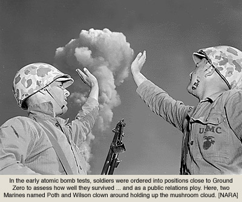

# Nuclear Radiation and the Environment

Joseph Penta

## Nuclear Tests

Nuclear radiation has been known by scientists since the late 1800s, but its practical applications were discovered within the mid twentieth century. The atomic fission of certain elements has provided a prime vehicle for obtaining excessive amounts of energy. Scientists have learned that this process can be a great aid to the human race or a weapon of mass destruction.

##### Oak Ridge Tennessee

.jpg)

In 1942 the United States government began the Manhattan Project in order to harness the power of Nuclear Fission as a weapon in the war effort. A small farm in eastern Tennessee was appropriated in order to build a simulation laboratory. This land was acquired by the Ohio River Division of the Army Corp. of Engineers to the dismay of thousands of families. Some of these families were already displaced about a decade prior for the construction of the Norris Dam, a hydroelectric power plant on the Tennessee River. Due to the war effort gas, tires, and moving vehicles were in short supply, so many of the residents could take only what they could carry. This location was important because the government needed 53,000 acres of open space for the four types of test facilities they were going to construct. The facilities, on average, were said to use 150,000 KW of electricity and 370,000 gallons of water per minute. For ease of employees, a small town known as Oakridge was built to house their families and those of the displaced. This town began with a population of 15,000 and grew to over 80,000 at its peak.[\[1\]](#1) By the end of the project, over half of the residents of Oak Ridge were some sort of employee of the project. The inventions of these facilities would serve as controlled tests of the first nuclear reactors.

##### Trinity Site

The testing of the weapons was conducted in a much more deserted area for fear of the immense collateral damage. The first blast of the Trinity Test was executed in the White Sands Missile Range in the Jornada del Muerto desert of New Mexico. The set up was a 100 foot steel tower with the device resting on top. The explosion was the equivalent of 21 kilotons of TNT (four times greater than calculated), and produced a new element known as "trinitite." This element was found to be extremely radioactive, and the fallout could be measured for miles around. Cattle 30 miles away from the explosion were found with discolored back hair and radiation burns. [\[2\]](#2)The U.S. Army bought these cows from the ranchers in order to further test the long term effects of the radiation. 

Fulgarite and Impactite, minerals associated with lightning strikes and meteor crashes respectively, were also found in the range of the explosion. Windows were shaken to shatter as far as a couple of hundred miles south. As film badges were used to test for limits of radiation exposure, it’s no surprise that the Kodak film industry would be affected as well. Film reel footage of the first few milliseconds of the blast was greatly damaged simply by the massive heat and light exposure. [\[3\]](#3)

As far as Indiana, commercial film had shown significant signs of impurity or defect. August 1945, the bomb was dropped in Hiroshima and Nagasaki, but this was too soon and too far for any trace of fallout to reach the United States. A small bit of radiation had gotten into the water supply of a paper mill where the packaging material for Kodak film was made, and it had contaminated the product. 

##### Marshall Islands

In the 1950s, President Truman ordered the increase in Nuclear Weapons research for fear of the, once allied, Soviet Union threat within the Cold War.[\[4\]](#4) The United States moved research to newly acquired Marshall Islands to minimize the threat of collateral damage. Despite the remote distances in this attempt, many of the locals were still threatened by the exposure of fallout. [\[5\]](#5)

United States would detonate thermonuclear bombs and send in Marines and soldiers with radiation badges to test the effects of prolonged radioactive exposure in combat zones. The local populace was said to be primitive enough that the testing would be overlooked. The residents of Bikini Atoll were moved to the smaller Rongerik Island under the supervision of their King Juda. 

As the colonization of the Marshall Islands of Micronesia increased, the United States sent anthropologists to study the tribes. [\[6\]](#6)Medical researchers, officials from the Department of Energy, and volunteers from the Peace Corps discovered over two hundred citizens medically affected by the radiation of the testing on adjacent islands. Fewer than two hundred survived until the 1980s when the United States planned to offer medical assistance for the discovery of "excess cancers." [\[7\]](#7) For the 67 nuclear tests conducted in the islands, less than half of predicted cancers were found among survivors. Since 2004 the Marshallese tribes have been on a path to self sufficiency. Although the compensation for ‘land use’ was paid by the US government, the locals have been striving to get off of the welfare systems emplaced and achieve self governance in modern times.

 

## Nuclear Accidents

The power of nuclear research was not limited to the construction of weapons. Thermonuclear power plants provide electricity to millions of people the world over. With smaller facility requirements than hydroelectric dams and fossil fuel burning electrical plants, nuclear plants are theoretically more efficient and environmentally friendly.

##### Chernobyl

Although thought to be more efficient, developers are not always accounting for catastrophic accidents. In April 1986, a Soviet Power plant in Pripyat, Ukraine with admittedly faulty structure suffered a devastating fire. When performing system failure tests in the Chernobyl power plant, an electrical short in a safety system ignited graphite fuel shields. [\[8\]](#8) The fire lasted for nine days and extremely hazardous radiation from the reactor was spread with the fumes.

This cesium-137 fueled radiation spilled into surrounding areas and even to adjacent countries by the strong winds. Belorussia received 60% of the radioactive fallout and military jets had to force rainfall of contaminated clouds over less populated areas. Within the radiation zone, many villages were abandoned. Without the proper maintenance even metallic structures fell into disarray due to rust. 

Large manmade buildings serve as nesting points for all sorts of animals. Dilapidation of artificial dams in the area has allowed for the Pripyat marshlands to recover from the settlements established in the 1930s. Most animals do not live long enough to suffer from radiological cancer, so their presence is more welcomed in the harsh zone.  Wildlife near Pripyat has thrived from the prolonged absence of humans. Further radioactive mutation, has allowed indigenous vermin to increase reproduction when compared to controlled studies. Without the hunters and deforestation, the native wolf population has since increased by feeding on the rodents and lesser mammals. [\[10\]](#10)

 

With the wolves able to hunt freely, the carrion birds such as ravens, vultures, hawks, and eagles are able to feed once more on the left over prey. Radioactivity in their fur, and enlarged teeth were just some evidence of wolves travelling between hot and cold zones.
Water near the power plant’s cooling tower is contaminated with deuterium, which is toxic to most animals. As a result fish in the area, which were not affected by deuterium poisoning, have grown too large to be hunted by avian predators. The fish grow as they age, are said to live to almost 100 years if left alone, and not because of any rampant growth mutation. 

Researchers have also planted thousands of trees in the area to stave off the radionuclides from causing further erosion. Plants have been known to absorb acidic materials in their given water supplies as a peripheral process of photosynthesis. It was discovered that the trees planted near the power plant had absorbed one thousand times as much radiation as their control counterparts. [\[9\]](#9)The form of positively charged fallout left behind metabolically acted in the same manner as acidic chemicals. The trees themselves have been clearing radiation from the area, but at the great risk of further violent reactions should they be disturbed.

##### Fukushima

Human error is not the only cause for alarm when safeguarding nuclear powered technologies. In 2011 the nuclear power plant in Fukushima, Japan aptly named Fukushima I, was hit by a massive earthquake and tsunami. While the reactors were able to shutdown their fission reactions following the earthquake, the subsequent tsunami destroyed the backup system which was cooling them during the stand by phase. There was no greater explosion than hydrogen air bursts emitting form the reactors, but this was still great damage. With the walls weakened, radioactive fallout was able to get into the groundwater systems. 

While none of have been killed by radiation poisoning, the risk of cancer for populations in surrounding areas has increased by almost 10%. Most of the citizens in Fukushima were found to be safe from radiological exposure at the time of the disaster; but as the fallout progressed, more and more citizens were found to be exposed in non-detrimental doses of 1.7 to 2.8 millisieverts. [\[11\]](#11) As a precaution the World Health Organization set up a growing exclusion zone around the defunct power plant, which increased to a 20 km radius by 2013.

Despite this, radioactive ash was found throughout mainland Japan following the disaster. Ash from the burning reactors, containing cesium, was carried through the air to neighboring prefectures. While most readings show well below a strong dosage, the volume in some areas has increased. Fukushima was a wealth of agricultural land and many farms were affected. Hundreds of cows were found to be irradiated or fed contaminated food stock. This industry affected almost half of the Japanese provinces. Rice and noodles are staple foods in Japan, and require lots of fresh water. Charcoal filters made with wood from Fukushima were accidentally used for private water treatment. Rice patties south of the disaster were found to have some cesium remnants, but less than 1% of an effective dose per kilogram of rice.

Drinking water in nearby prefectures was found by the IAEA to be within safe limits of cesium and iodine, however present. In contrast to Chernobyl’s growth of wildlife, the fauna of Fukushima have been suffering more than their human counterparts. Once again plants and mushrooms were found to absorb radioactive cesium through their roots. Wood found to be irradiated by this disaster is currently found to burn with 85% mass to energy efficiency rate in foreign labs. This new biomaterial could help with power plants and nuclear research across the world.[\[15\]](#15) Animals that ate these plants however, were found to suffer from extreme doses of radiation sickness. [\[12\]](#12)

 

While Japan appears to be in a stable position with regards to the effects of radiation, signs of danger have migrated to the ocean. Plankton colonies off the eastern shore of Japan have tested positive for cesium contamination.[\[13\]](#13) Fishing is allowed outside of 10km from the reactors, but the effects are still present beyond that arbitrary boundary. Plankton are a major food source for wild fish, and the humans and animals who eat these are in dangerous of become sick themselves. The radiation leaks are said to be fixed between 2017 and 2021; some speculate the aqueous fallout could reach as far as Alaska, but tests are still being done on the water and wildlife there. [\[14\]](#14)

 

##### Bibliography
1.  "Clinton Engineer Works." Wikipedia. Wikimedia Foundation, n.d. Web.
"Jornada del Muerto""Clinton Engineer Works." Wikipedia. Wikimedia Foundation, n.d. Web.
"White Sands Missile Range." Wikipedia. Wikimedia Foundation, n.d. Web.
"Trinity Test." Wikipedia. Wikimedia Foundation, n.d. Web.
2.  Simon, Steven L. "Study to Estimate Radiation Doses and Cancer Risks Resulting from Radioactive Fallout from the Trinity Nuclear Test." National Institute of Health. U.S. Department of Health and Human Services. 
[Reference](https://dceg.cancer.gov/research/how-we-study/exposure-assessment/trinity)
3.  Wellerstein, Alex. "The First Light of Trinity." The New Yorker (2015)
[Reference](http://www.newyorker.com/tech/elements/the-first-light-of-the-trinity-atomic-test)
4.  "Operation Ivy 1952 Enewetak Atoll, Marshall Islands." Nuclear Weapons Archive. May 14, 1999. 
[Reference](http://nuclearweaponarchive.org/Usa/Tests/Ivy.html)

5.  Wellerstein, Alex. "Enough Fallout for Everyone." Restricted Data, The Nuclear Secrecy Blog. Alex Wellerstein. August 3, 2012. Web.
[Reference](http://blog.nuclearsecrecy.com/2012/08/03/enough-fallout-for-everyone/)

6.  Barker, Holly M. Bravo for the Marshallese: Regaining Control in a Post-nuclear, Post-colonial World. Australia: Thomson/Wadsworth, 2004. Print.

7.  Monitor, By Green Planet. "Green Planet Monitor." Green Planet Monitor. N.p., 2014.

8.  "Chernobyl disaster."  Wikipedia. Wikimedia Foundation, n.d. Web.

9.  Yoschenko, Vasyl I., Valery A. Kashparov, Maxim D. Melnychuk, Svjatoslav E. Levchuk, Yulia O. Bondar, Mykola Lazarev, Maria I. Yoschenko, Eduardo B. Farfán, and G. Timothy Jannik. "Chronic Irradiation Of Scots Pine Trees (Pinus Sylvestris) In The Chernobyl Exclusion Zone: Dosimetry And Radiobiological Effects." Health Physics 101.4 (2011): 393-408.
[Reference](https://www.ncbi.nlm.nih.gov/pubmed/21878765)
10.  "Radioactive Wolves Of Chernobyl Scary Mutations - Full Documentary." YouTube. YouTube, 2014. Web.
[Video]( http://www.youtube.com/channel/UCwF4Ffn5MPOwLv-sOd5sxpw)

11.  "Radiation effects from the Fukushima Daiichi disaster." Wikipedia. Wikimedia Foundation, n.d. Web.
12.  Andrews, Timothy."Thousands of radioactive boars are overrunning farmland in fukushima." The Washington Post. Aprill 11, 2016. Newspaper.
[Reference](https://www.washingtonpost.com/news/morning-mix/wp/2016/04/11/thousands-of-radioactive-boars-are-overrunning-farmland-in-fukushima/)
13.  Buesseler, Ken. "5 years later, Fukushima radiation continues to seep into the Pacific Ocean." PBS Newshour. NewsHour Productions LLC. March 9, 2016. Media.
[Reference](http://www.pbs.org/newshour/updates/fukushima-radiation-continues-to-leak-into-the-pacific-ocean/)
14.  "Fukushima Accident." World Nuclear Association. England and Wales. July 2016.
[Reference](http://www.world-nuclear.org/information-library/safety-and-security/safety-of-plants/fukushima-accident.aspx)
15.  Parkin, Brian. "Radioactive Fukushima Wood Becomes Power in German Machine." Bloomberg. Bloomberg LP. October 25, 2016.
[Reference](http://www.bloomberg.com/news/articles/2016-10-25/radioactive-fukushima-wood-becomes-power-in-german-biomass-plant)
##### Other Works Cited
1.	Associate Press. "Earthquake reported near North Korea Nuclear Site." New York Post. NYP Holdings Inc. September 8, 2016. 

2.	CIA. "Cuban Missile Crisis Map of Missile Range." October 1962. JFKlibrary. [Reference](https://www.jfklibrary.org/Asset-Viewer/15JC38yN2E-zS8u0K1O-ow.aspx)

3.	Clark, John C. Dr. "We were Trapped by Radioactive Fallout." Saturday Evening Post. July 1957.  

4.	Ganzel, Bill. "Watching an A-Bomb." Farming in the 1950s & 60s. Living History Farm. 2007.

5.	Hamilton, Terry Dr. "Bikini Atoll." Marshall Islands Dose Assessment & Radioecology Program. April 7, 2015. 
[Reference](https://marshallislands.llnl.gov/bikini.php)

6.	History, Office of. "A Brief history of NORAD." North American Aerospace Defense Command. March 2014. Pdf record.

7.	Kattenburg, David "Stranded on Bikini, Nuclear Paradise Revisted." Nov. 16, 2013. [Reference](http://www.greenplanetmonitor.net/news/conflict-and-environment/stranded-on-bikini/)

8.	Land, CE "Projected lifetime cancer risks from exposure to regional radioactive fallout in the Marshall Islands."  NCBI. National Institute of Health. US  National Library of Medicine. August 2010.

9.	Moran, Tom. "Anatomy of a Titan Nuclear Missile Silo." Urban Ghost Media. March 22, 2010. [Reference](http://www.urbanghostsmedia.com/2010/03/anatomy-of-a-titan-nuclear-missile-silo/)

10.	Peterson, Kristen. "Welcome to Doom Town: Stories and Scars from Under the Cloud of a Nuclear Nevada." Las Vegas Weekly. October 4, 2012.

