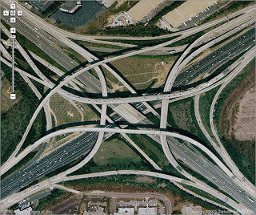

# Roadways and the Landscape
Tagenarine Paray  
Technology and the Landscape  
27 October 2016

Roadways and interstates, as well as bridges, tunnels, and overpasses, have become common sights across the landscape of the United States. Most roadways, specifically highways in major cities, are almost always covered with cars, traffic, traffic lights, tire roar, engine noises, toxic fumes, street lights, directional signs, and road rage. However, prior to the era of roadways and automobiles was the era of dirt roads. According to Abrams, “our first roads were spontaneously formed by humans walking the same paths over and over to get water and find food. As small groups of people combined into villages, towns and cities, networks of walking paths became more formal roads” [\[1\]](#1). Eventually, as humanity advanced, roads started to take on heavier loads, such as horse-drawn carriages, putting a significant burden on the roads.

*Figure 1: Lewis and Delancy Street, 1893- [\[16\]](#16)*
  
Above is an image from 1893 of the lower east side of Manhattan on Lewis street, north of Delancy street. As seen in the image, the roads were broken up and filled with trash and dirt. They lacked most of the modern amenities such as street lights and signs. Furthermore, the roads were filled with horse carriages and would become useless when it rained as the dirt turned into thick mud. 

*Figure 2: Lewis and Delancy, 2016- [\[17\]](#17)*

Above is a google maps version of the same area in 2016. Compared with the image from 1893, the street is clean, filled with cars, road signs, lane markers, and street lights. Moreover, the roads are smooth and maintained, allowing for a higher speed of travel and heavier loads. From the above two images, it is easy to see how both the landscape and the roadway have worked and evolved together over time. This is especially apparent when considering the fact that the small residential houses have been replaced with large apartment buildings, indicating economic growth.

The main transition from the era of carriages to the era of cars was the introduction of Henry Ford’s Model T. Prior to the Model T, the majority of people living in America relied heavily on horses and carriages for transportation. Realizing the need for a better alternative Henry Ford designed the Model T as a “practical, affordable transportation for the common man, prized for its low cost, durability, versatility, and ease of maintenance” [\[22\]](#22). This was primarily due to the fact that the Model T was mass produced on the world’s first assembly line, which enabled Ford to produce his product quickly and efficiently, compared to his competitors. Due to its popularity with the common working man, Ford sold over 15 million Model Ts between 1913 and 1927 [\[22\]](#22). After Ford’s introduction, many other businesses appeared, creating their own versions of the car, allowing people to choose from minimalistic, functional cars to big, luxurious automobiles. 

*Figure 3:Ford Advertisement- [\[12\]](#12)* 

As seen above, Ford created many different variations of the origional Model T, tailoring specific models to specific customers and keeping himself competitive in the market. This is a testament to the fact that more and more people were moving into cars and out of carriages, especially when considering that “There were 300 cars in the United States in 1895, 78,000 in 1905, 459,000 in 1910 and 1.7 million in 1914” [\[7\]](#7). Not only did this new influx of automobiles on the road increase the need for new infrastructure and roadways, it also convinced other people to replace their horse carriages with cars. It was the new fast and efficient way of traveling.

The construction process of roads across America has remained relatively unchanged, since the introduction of the affordable automobile, with the main difference being the equipment used to construct them. 

*Figure 4: Road Scraping, Early 1900’s – [\[30\]](#30)*

*Figure 5: Road Paving, Early 1900’s – [\[9\]](#9)*

*Figure 6: Road Smoothing, Early 1900’s – [\[31\]](#31)* 

As seen in the above images, workers would construct the roads utilizing horses, carriages, tractors, picks and shovels. The process involved creating a path through the landscape, filling it with asphalt or concrete, and then rolling over it with something heavy to make the material smooth and compact to withstand heavy loads without cracking. As aforementioned, the image below shows how the process remains the same. The modern version of road paving utilizes the same method used in the early 1900s, but more efficient and purpose built equipment to help reshape the landscape. As seen in the image below, the road being constructed is going straight through a forested area, altering the landscape not only visually but also ecologically. The roadway has essentially created a boundary for the local wildlife, separating the forest area from the open green area.

*Figure 7: Modern Road Construction – [\[32\]](#32)* 

Beside the techniques used to construct the modern roads of America, it is also important to note the different shapes of the roads and what caused them to be that way. One of the main influeneces is the landscape that the road is going to be constructed over, as seen on the Blue Ridge Parkway and the Skyline Drive. According to Bush, “they dip into hollows, climb above timberline, and coil around summits. At every overlook, chain upon chain of mountains recede into the cerulean distance” [\[5\]](#5). Moreover, the parkway is made up of winding roads, changes in elevations, hair-pin turns, tunnels, bridges, and nature. 

*Figures 8-14: Scenic Blue Ridge Parkway- [\[4\]](#4)* 

As seen from the above images, the Blue Ridge Parkway is truly a dynamic road constructed around nature. It is a great example of how the aforementioned road technology has allowed us to construct roads all the way up into the Appalachian Mountains, giving people the opportunity to be tourists without ever having to leave the comfort of their own car. According to the Deseret News, “The road was actually intended to boost auto tourism between two relatively new national parks -- Shenandoah in Virginia and Great Smoky Mountains in North Carolina and Tennessee” [\[3\]](#3). However, due to the fact that it is completely surrounded by wildlife and natural scenery, the parkway itself became a sight for tourism. I have personally made several trips down south primarily to visit the Blue Ridge Parkway, due to the landscape that it is located in. Living in New York restricts me to driving only on straight, boring, broad roads filled with angry New Yorkers. However, by visiting the Parkway, I was able to experience what it is like to drive on a completely different type of road in a completely different type of environment. Not only was the road smooth, curvy, hilly, and thin, it was also completely covered and hidden by nature. It was very lonely and serene, much like when wandering in the middle of a forest. Furthermore, the parkway itself was very beautiful to look at, as seen in the above images. From an artistic point of view, the parkway creates a nice contrast to nature weaved within the landscape. While driving along the parkway, it felt almost as if the road was naturally a part of its surroundings, which is what it was designed to do. The image below was taken at one of the peaks of the Parkway on Grandfather Mountain, exactly one mile above sea level, displaying how effectively we have been able to place and combine our technology within the landscape. Besides giving people the opportunity to drive along mountain ranges with bridges and through the mountains with tunnels, engineers are able to safely put families and their cars at the peak of the mountains by integrating the roadways into the landscape in such a way that doesn’t disrupt the local environment. 

*Figure 15: Grandfather Mountain Trip*

Besides the iconic and unique roadways, such as the Blue Ridge Parkway, it is important to think about the common roadways, such as the interstates, to fully appreciate the road technology spread across our landscape. It all started with the opening of the Pennsylvania Turnpike in 1940, “which had four lanes, flat curves and low grades, and ushered in an era of faster, safer travel that wouldn't bankrupt governments,” when compared to the existing highway system whose “death rates were more than four times higher per mile than today” [\[21\]](#21). Not only did the interstate system gaurantee motorists a safer ride, it impacted almost every person in America. According to the U.S. Department of Transportation, “every citizen has been touched by it, if not directly as motorists, then indirectly because every item we buy has been on the Interstate System at some point” [\[20\]](#20). Furthermore, President Eisenhower, the main proponent of the interstate system, was highly concerned about the threat of atomic attacks on America’s Major cities. Thus, he instituted a set of guidelines that will not only allow pedestrians to get out of the danger zones quickly, but also provide emergency landing zones for airplanes as seen below. 

*Figure 16: Interstate 5 – [\[28\]](#28)*

According to the U.S. Department of Transportation,  the “design standards for the Interstate System include full control of access, design speeds of 50 to 70 miles per hour (depending on type of terrain), a minimum of two travel lanes in each direction, 12-foot lane widths, 10-foot right paved shoulder, and 4-foot left paved shoulder” [\[11\]](#11). In addition, the Department allows the standards to be altered every two years, depending on the amount of traffic. 

*Figure 17: Interstate Map in the U.S. – [\[25\]](#25)*

Above is a map of the 41,000 miles of interstate roadways that started being constructed under the Presidential term of Eisenhower. As seen on the map, it connected the country in such a way that allowed the common man to travel across the country is a safe and direct manner, instead of relying on the existing rudimentary roads or the rail system. Moreover, it connected all of the country’s major cities, as indicated by the yellow stars, which made it easy for people to travel and transport their goods directly to their destination. Below is an image of a section of the original highway system, which has no safety rails, lane markers, or street lights. Thus, it made for a very treacherous motoring experience, especially when considering the fact that these roads hosted two-way traffic.

*Figure 18: Highway Prior to Interstates – [\[24\]](#24)*

Besides creating a safer, more efficient mode of travel, the interstate system also allowed the economy and local neighborhoods to boom, while also creating some beautiful roadways and structures. According to Wray, “When the new highways opened, the results were almost immediate.  Suburbs sprung up all over the United States” [\[33\]](#33). This is due primarily to the fact that the interstate gave people a faster way to travel in and out of the major cities. Residents no longer had to live in small apartments located next to their jobs. They could now live 20-30 miles away and live in full sized homes. This also led to the eruption of businesses alongside the new interstates and the new suburbs. According to Gutfreund, “Shopping centers and malls went up at a pace matched only by the speed at which developers laid out new subdivisions along suburban highways” [\[18\]](#18). Below on the right is an image of the Westland Mall alongside Interstate 270, which was still under construction. On the left is a present day, Google Maps version of the same area. As seen in the image, the mall was located right next to the exit and entrance ramps of the interstate, giving people easy access to the mall. Again, the interstate served as a safe and quick way for people to get where they needed to be, such as the mall. Moreover, it is apparent how both the interstate and the mall have become an integral part of the landscape. Not only is it a source of transportation, it is the source of all of our goods and has become the lifeline of America. This is especially true when considering the fact that all of our goods today are being moved around by trucks traveling on the interstate, as mentioned before. 

*Figures 19 & 20: Westland Mall/Interstate 270 Present [\[17\]](#17) and Past [\[27\]](#27)* 

Furthermore, it is important to note how the interstate itself has become the landscape. It had been installed in the mid 1900’s and has remained there ever since, becoming a common sight for all Americans and being used constantly ever since its creation. Now, when creating new roadways, engineers have to look out for both nature and the existing interstate system. Thus, engineers now rely heavily on the use of overpasses and tunnels, shown below. 

*Figure 21: Above is a Google Maps image of a junction in Atlanta, linking two interstates to each other. [\[17\]](#17)*

*Figure 22: Below is an image of interstate 40 flowing through the valleys of New Mexico.[\[2\]](#2)* 

*Figure 23: Below is an image of the entrance of the Eisenhower Tunnel along Interstate 70. - [\[23\]](#23)*

*Figure 24: Below is the proposed Trinity River Bridge along interstate 30.- [\[10\]](#10)*

*Figure 25: Below is an image of interstate 405 weaving itself through West Los Angeles.-[\[13\]](#13)*

*Figure 26: Below is an image of interstate 10 during rush hour running through Houston, Texas. – [\[8\]](#8)* 

*Figure 27: Below is a picture taken below one of the main junctions of interstate 10. – [\[14\]](#14)*

As seen in the images above, the interstate has morphed into something dynamic and unique, while also blending into the landscape. Much like the Blue Ridge Parkway, the interstate provides a unique experience for the motorist and offers them the opportunity to see the landscape in the comfort of their own cars. Although the aforementioned landscape may not be the original, natural landscape that existed before the automobile, it is the landscape that we live with today. Whether it is through wooded areas and mountains or through urban and metropolitan areas, the interstate, and the rest of the modern roadways, allow motorists to fully appreciate America’s landscape. This is especially true when considering the fact that America hosts over four million miles of active roads. The roads also give motorist the chance to be connected to their past, as the routes themselves rarely change. 

*Figure 28: Never Ending Road [\[29\]](#29)*

According to Garre, “Roads are historically fixed and joint footprints of people, goods and vehicles in the landscape” [\[15\]](#15). In other words, roads were used by our ancestors, are used by us today, and will be used by our descendants in the future. They are stuck in time and unaltered by time, with the exception of being repaved. When the roads were introduced, they altered the existing landscape. However, as previously mentioned, they have become a vital part of the landscape. The landscape is now the host of the lifeline of modern transportation and survival. This is truly apparent when one considers what would happen if there weren’t any modern roads or cars. The roads of modern times provide a safe, efficient, and fast way of traveling across the country while blending into the landscape in such a way that allows it to be considered the norm.

# Work Cited

1.	Abrams, Steve. "The Unseen History of Our Roads." Road & Track. N.p., 03 Dec. 2014.  Web. 12 Oct. 2016. http://www.roadandtrack.com/car-culture/a4447/the-road-ahead-road-evolution/
2.	Ames, Justin. "Driving Across The Country." The Velvet Rocket. N.p., 04 Feb. 2011. Web. 26 Oct. 2016. https://thevelvetrocket.com/2011/02/04/driving-across-the-country/
3.	"Blue Ridge Parkway." Deseret News (2006): T01. Print.
4.	"Blue Ridge Full Galaria." Fansshare. N.p., n.d. Web. 22 Oct. 2016. http://spanish.fansshare.com/gallery/photos/17132456/web-blueridgepkwy-movie/
5.	Bush, George S. "Blue Ridge Parkway." Better Homes and Gardens 72.5 (1994): M3. Print.
6.	By 1878 the Second Avenue El. "German New York, Lower East Side, Manhattan,     Kleindeutschland." German New York, Lower East Side, Manhattan, Kleindeutschland. N.p., n.d. Web. 12 Oct. 2016.
7.	"Car History 4U - History of Motor Car /Automobile Production 1900 - 2003." Car History 4U – History of Motor Car / Automobile Production 1900 - 2003. N.p., n.d. Web. 12 Oct. 2016. http://www.carhistory4u.com/the-last-100-years/car-production
8.	Carol, Christian. "Bragging Rights or Embarrassment? Katy Freeway at Beltway 8 Is World's Widest." Houston Chronicle. N.p., n.d. Web. 26 Oct. 2016. http://www.chron.com/neighborhood/katy/news/article/Bragging-rights-or-embarrassment-Katy-Freeway-at-6261429.php
9.	"Construction – General." The History of Sanitary Sewers. N.p., n.d. Web. 18 Oct. 2016. http://www.sewerhistory.org/photosgraphics/construction/       
10.	Curtis, Brian. "New Dallas Landmark Bridge Taking Shape." NBC 5 Dallas-Fort Worth. N.p., n.d. Web. 19 Oct. 2016. http://www.nbcdfw.com/news/local/New-Dallas-Landmark-Bridge-Taking-Shape-277930611.html
11.	"Dwight D. Eisenhower National System of Interstate and Defense Highways." Interstate System. U.S. Department of Transporation, n.d. Web. 17 Oct. 2016. https://www.fhwa.dot.gov/programadmin/interstate.cfm
12.	"Early Ford Model T Advertisements | Ford Model T Photo Gallery." Early Ford Model T Advertisements | Ford Model T Photo Gallery. N.p., n.d. Web. 18 Oct. 2016. Gallery." http://www.fordmodelt.net/gallery2/index.php?/category/11
13.	Elnina. "The 405 Freeway Snaking Northbound through the Sepulveda Pass in West Los Angeles." Flickr. Yahoo!, n.d. Web. 22 Oct. 2016. https://www.flickr .com/photos/69730369 @N06/16160789970
14.	"File:High Five Interchange.jpg." Wikimedia, n.d. Web. 21 Oct. 2016. https://commons.wikimedia.org/wiki/File:High_Five_Interchange.jpg
15.	Garré, Sarah, Steven Meeus, and Hubert Gulinck. "The Dual Role of Roads in the Visual Landscape: A Case-Study in the Area Around Mechelen (Belgium)." Landscape and Urban Planning 92.2 (2009): 125-135. Print.
16.	"German New York, Lower East Side, Manhattan, Kleindeutschland." German New York, Lower East Side, Manhattan, Kleindeutschland. N.p., n.d. Web. 18 Oct. 2016. Yorkhttp://www.maggieblanck.com/NewYork/LowerEastSide.html
17.	"Google Maps." Google Maps. N.p., n.d. Web. 12 Oct. 2016.
18.	Gutfreund, Owen D. Twentieth-Century Sprawl : Highways And The Reshaping Of The American Landscape. New York: Oxford University Press, 2004. Print.
19.	Hemmings.com. "1908-1927 Ford Model T." Classic Cars for Sale. N.p., n.d. Web. 18 Oct. 2016.
20.	"Highway History." History of the Interstate Highway System. U.S. Department of Transporation, n.d. Web. 16 Oct. 2016. https://www.fhwa.dot.gov/interstate/history.cfm
21.	"Historical - in 1956, Pioneering Legislation Set the Stage for the Funding and Building of America's Interstate Highways." ENR 256.2 (2006): 31 . Print.
22.	History.com Staff. "Model T." History.com. A&E Television Networks, 2010. Web. 12 Oct. 2016. http://www.history.com/this-day-in-history/ford-motor-company-unveils-the-model-t
23.	"Home." I-70 West Eisenhower Tunnel -. N.p., n.d. Web. 26 Oct. 2016. https://www.codot.gov/images/photos/highways/dsc_2192.jpg/view
24.	"Info Needed on Old U.S. 466 through Tehachapi Pass." Info Needed on Old U.S. 466 through Tehachapi Pass. N.p., n.d. Web. 25 Oct. 2016. http://www.aaroads.com/forum/index.php?topic=14577.0
25.	"International Right of Way Association Top Ten Infrastructure Projects Countdown." SiteK Construction Zone RSS. N.p., n.d. Web. 26 Oct. 2016. http://www.site-kconstructionzone.com/?p=79
26.	Menchaca, Ron. "Motorcycle-Riding History Professor Pens New Book on Dixie Highway." The College Today. N.p., 06 Apr. 2015. Web. 18 Oct. 2016.
27.	Nick E. "Westland Mall in Columbus, Ohio." Dead and Dying Retail:. N.p., 01 Jan. 1970. Web. 22 Oct. 2016. http://www.deadanddyingretail.com/2013/09/westland-mall-in-columbus-ohio.html
28.	Rotolo, Larry. "Mid-Coast Corridor San Diego Trolley Extension Public Meeting to Be Held." SD Entertainer Magazine. N.p., 17 May 2013. Web. 21 Oct. 2016. http://www.sdentertainer.com/news/mid-coast-corrider-san-diego-trolley-extension-public-meeting-to-be-held/
29.	Scott, Justin K. "Justin." Justin. N.p., n.d. Web. 26 Oct. 2016. http://justinkscott.tumblr.com/post/64917799313/the-road-not-taken-by-robert-frost
30.	Stokes, Stephannie. "From Inter-Town Rivalries To Chain Gangs: The History Behind The Dixie Highway." 90.1 FM WABE – Atlanta's NPR Station. N.p., n.d. Web. 18 Oct. 2016. http://news.wabe.org/post/inter-town-rivalries-chain-gangs-history-behind-dixie-highway
31.	Turnbull, Alexander. "Road Construction, Early 1900s." New Zealand Ministry for Culture and Heritage Te Manatu Taonga. Ministry for Culture and Heritage Te Manatu Taonga, n.d. Web. 17 Oct. 2016. http://www.teara.govt.nz/en/photograph/5209/road-construction-early-1900s     
32.	"Worldwide Project Partners." Worldwide Project Partners. N.p., n.d. Web. 20 Oct. 2016. http://www.worldwideprojectpartners.com/projects
33.	Wray, Sheila. "America's Interstate Highway System." A Line from Linda:. N.p., 01 Jan. 2013. Web. 18 Oct. 2016. http://alinefromlinda.blogspot.com/2013/10/october-4.html

