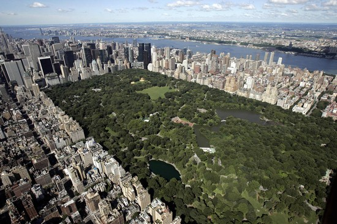
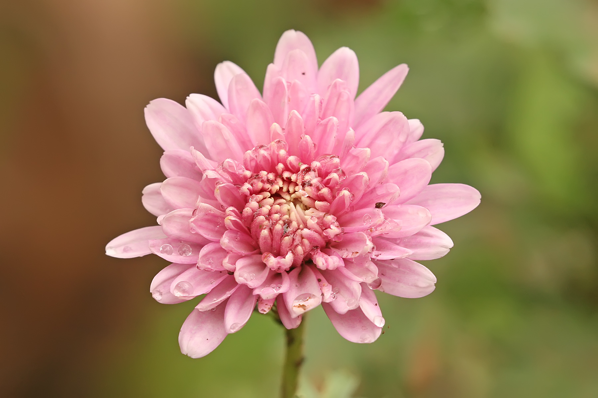
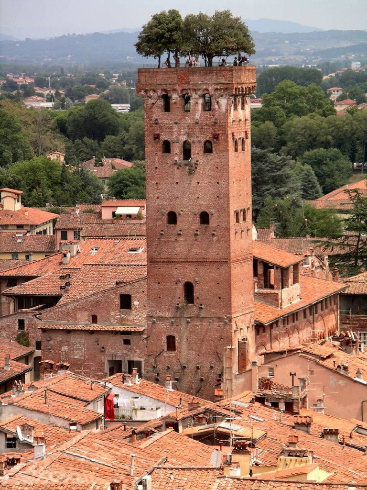
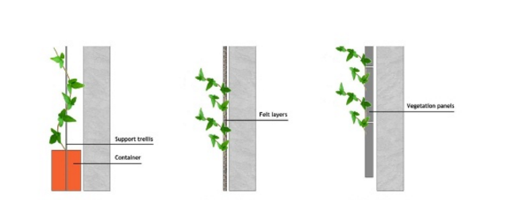
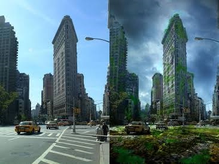
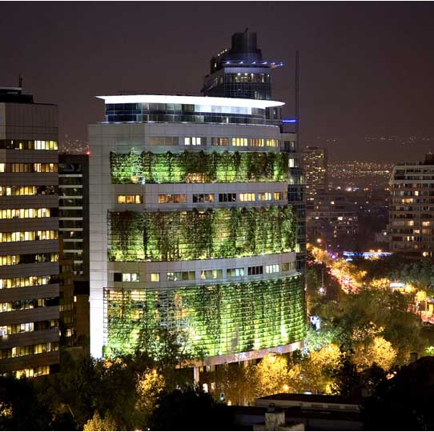
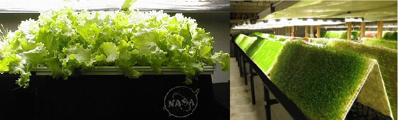
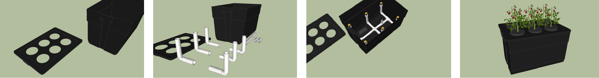
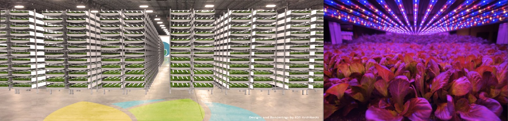
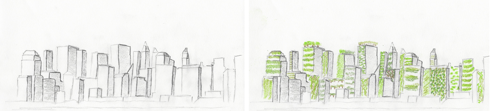

# Urban Agricultural Spaces

Spencer Pinto

There has always been a distinct divide between the agricultural and urban environments. There is city and there is forest. True, there are parks in the city, trees placed along the streets and bushes surrounding buildings, but these things do not over lap. Central park is a perfect example of this. There are walls of city surrounding a small forest. The divide between that park and the city could be draw with a marker. The suburbs are also an example of this, however the forest is much more integrated between the city. Each house is surrounded by grass and trees but once again that immediately stops once you reach the side walk or another building. There is hope that this divide will one day be closed. But you may ask, "why should this gap be closed?" Well there are several reasons. 

*Figure 1. Aerial Picture of Central Park. [\[1\]](#1)*

## Why Bother Closing the Urban/Agricultrual Gap?

One, the environmental conditions in the city tend to be less than optimal. Air quality due to carbon emissions and other pollutants are the worst in highly populated cities. Los Angeles in Long Beach, California for example has the some of the worst air quality in the entire United States. Heavy pollution souces are the ports in which the ships burn high-sulfur, high-soot-producing bunker fule to maintain internal electrical power while docked, as well as diesel pollution from drayage trucks at the ports, and short-haul tractor-trailer trucks ferrying cargo from the ports to inland.  Although great efforts have been made to reduce this during the last decade, the pollution levels remain dangerously high. [\[2\]](#2) Plants act as natural air filtures. They literally pull carbon dioxide out of the air and release oxygen. There are even specific species of plants, like the Chrysanthemum indicum (Garden mum) which pull other pollutents (ammonia, benzene, formaldehyde, xylene etc.) out of the air in their growth process. [\[3\]](#3) 

*Figure 2. Picture of Chrysanthemum indicum (Garden mum). [\[4\]](#4)*

Two, the human population isn't getting any smaller. Now unless humanity plans on performing genecide soon, there are just going to be more people. The earth's current population is about 7.125 billion human beings and by 2050 the population is predicted to be 9.7 billion. [\[5\]](#5) As more people populate the earth, they will push out more and more from the cities and towns into the agricultural environment. Fields and forests will be replaced with streets and buildings. Green grass will be exchanged for black asphalt. An overlap of city and forest would remove the worry of consuming the agricultural land. The city would become agricultural land. There would be no distinction, granted certain plant types would not be grown in the city such as large trees being that buildings could not efficiently support them.

Three, farming can be converted into a more efficient and productive system when performed within buildings.  Farmers would no longer have to worry about seasons or weather conditions. Early frosts wouldn't destroy falls harvest and scorching summers wouldn't dry up the fields. Pesticides and herbicides wouldn't have to be used being that the threats of insects and pestilence would be eliminated. Plants would be able to grow in their optimal environments and nothing would be left to chance. Also as stated previously, this produce would filture the air of the surrounding environment in its continuous growth.

## Practical Ways Urban/Agricultural Overlap is Occuring 

Now I'm not trying to convince you that you should invest in urban environment adapting agriculture. The reason I'm going through this is because I want you to see that this is a very possible future. Its efficient and effective. It will solve problems that our society currently faces and will face in the future. This isn't just science fiction. Its practical.

### Rooftop Gardening 

A rational way this technology has been developed is in roof top and vertical vegetation design. Roof top gardening is a tried and true technique that has been implemented for centuries. The Guinigi Tower of Tuscany, Italy is a perfect example of this. This tower dates from the 1300s when a number of wealthy families built the tower with the rooftop garden serving as a kitchen garden. The tower was donated to the local government by the descendents of the Guinigi family and serves as a tourist attraction. The rooftop garden still remains to this day. [\[6\]](#6) 

*Figure 3. Picture of The Guinigi Tower of Tuscany. [\[7\]](#7)*

This vegetation design functions quite well in that the surface area of plant growth that is lost by the buildings base is made up for by simply growing plants over that same surface area on the roof. However only buildings with flat rooves are capable of this technique.

### Vertical Vegetation

A lesser know technique of even greater potential is vertical vegetation design. This technology utilizes scaffolding, felt layers and vegetation panels to grow plants on the side of buildings. 

*Figure 4. Diagram of three methods of vegetation anchoring, scaffolding, flet layers and vegatation panels. [\[8\]](#8)*

Think about it, buildings don't utilize their vertical surface area. If it was decided to grow vegetation on the northern side of the Empire State building, that would cover ~230,000 ft2.  The buildings base is only ~80,000 ft2. That means by growing these plants vertically on just one side of the building, 3X as much vegetation can be produced as would be if plants were grown in the base.  A 650 ft2 area of vegetation is needed to produce enough oxygen to sustain a adult human.  [\[9\]](#9) That means the empire state building's vertical vegetation could supply oxygen for 354 people. That just one building! If this were done on every building in Manhattan, the city could easily produce 2X as much vegetation or more than if all of Manhattan were farmed. If the same logic is used in this larger scale that means vertical vegetation in Manhattan could produce enough oxygen for 1,958,353 people. Manhattan only has a population of 1,626,000 people! This city could produce enough oxygen for its enitre population and an additional 330,000 people. Not to mention if the vegetation grown was edible it could produce 321,446,970 pounds of produce. A grown human adult consumes about ~2,000 pounds of food per year. [\[10\]](#10) Although a humans diet rarely consists of only vegetation, this could theoretically feed 160,723 people per year. 

*Figure 5. Picuture of Flatiron Building in Manhattan before and after vertical vegetation applied. [\[11\]](#11)*

The limiting factor for this technology is the lack of knowledge about its effectiveness and costs. There are several buildings currently in use that employ vertical vegetaion design.  However, these buildings utilize this technology more as a form of art than a practical means of aiding the environment. One such structure is the Concorcio building in Santiago, Chile. Worked with technical and natural resources, this building possesses a double facade: an inner with curtain wall and an outer with vegetation. This vegetation covers an area of 2,700 m2 and not only thrives in the summers but turns deep shades of red and yellow during the autumn season. [\[12\]](#12) 

*Figure 6. Picture of Concorcio Building in Santiago, Chile. [\[13\]](#13)*

The costs of the vegetation anchoring methods are still quite high. However, there is research being conducted showing thermodynamic benefits to vertical vegetation. The vegetation acts as an insolator for buildings. This reduces the building temperature in summers and lessens the wear of the environment on the structure. The Concorcio building reports to use up to 48% less energy in cooling the building due to the vegetation climbing up its exterior walls. Such benefits could counterbalance costs and make this technology not only practical but beneficial. [\[14\]](#14) Further research is still needed inorder for this to be comfirmed though. 

### Aeroponic Farming

Another technology being developed is areoponic farming. The basic principle of aeroponic growth is to grow plants suspended in a closed environment by spraying the plant's dangling roots and lower stems with an nutrient-rich water solution. The roots of the plants are supported by a reusable clothe material. This technology was first discovered by W.Carter in 1942 who researched air culture growing and described a method of growing plants in water vapor to facilitate examination of roots. However, it wasn't until 1997 that the technology was further practically developed by NASA for use on the Mir space station. 

*Figure 7. Pictures of NASA aeroponics testing facility. [\[15\]](#15)*

It was determined that aeroponic farming uses 95% less water and 50% less fertilizer than traditional farming techniques. This is due to that fact that the water in this closed system is contiuously recycled, only being replaced when the plant absorbs it. This was particularly attractive for NASA due to the frugal nature of there space missions. It was also recognized that this technique holds great potential for future colonization of other worlds. [\[16\]](#16)
	Creating a  aeroponic system at home is quite simple. All thats needed is a large vessel or plastic container, a garden fountain pump, sprinkler heads, some PVC piping, and net pots with foam lids. 
1. Cut holes for net pots in the roof of the plastic container
2. Connect PVC piping to pump on floor of plastic container
3. Have muliple off shoots PVC piping run upwards to about three fourths of the way to the containers ceiling
4. Place sprinkler heads on PVC piping running upwards
5. Place net pots in holes in roof of plastic container.

*Figure 8.  Pictures of DIY aeroponic system directions, first image on left step 1, second image from left steps 2-3, third image from left step 4 and final image step 5. [\[17\]](#17)*

Simply add water and fertilizer to the plastic container and the aeroponic system is complete. The pump should be run every 30 minutes for 30 minutes, so adding an outdoor electrical timer to the system would not be a bad idea. The net pots tend to grow well with leafy greens and vine based plants, however they are not limited to these options. [\[18\]](#18)

Companies such as Aerofarms are running their first aeroponic farming facilities in places as close as the Ironbound section of Newark. This Aerofarms facility serves mainly as a research and developement plant focused on data acquisition. Each plant is closely monitored and given specific wavelengths of light that are necessary for growth. Specific amounts of nutrients and water are given to the plants as researchers determine the optimal harvest conditions. Areofarms can produce as many as 30 harvests in a single year, vastly out pacing traditional farming methods. This farms is also built in a multi-layer fashion, generating nine or ten times the produce that would traditional be produced over a fixed surface area. Several other vertical farming companies have been started over the last 10 or so years, however these companies have failed due to bankruptcy. Aerofarms is hoping that by optimizing the production of plants and only transporting these plants to local markets they can begin to become a profitable business. One of the down sides of the Aerofarms agricultural production techniques is there use of LED lights. Although this allows plants to be grown 24 hours a day, it also requires a massive amount of energy. Half of all areofarm costs come from the energy spent on these LED lights. [\[19\]](#19) Also at this rate of energy consumption, this facility is actual increasing the carbon foot print and negates the fact that it is growing plants. Regardless, this technology should still be persued. Although it is not environmentally effiecent now, aeroponic developement is always improving. Eventually this goal will be accomplished. However if the technology is avoided because of this set back, it can never be improved.

*Figure 9. Pictures of Aerofarms facility in Newark. [\[20\]](#20)* 

## Why Aren't We There Today?

Now if this is such a good and practical idea to merge urban with agriculture, why isn't everyone doing it? Its because this technology hasn't been fully tested. Years of data don't exist that show these techniques work. All of the individuals and companies experimenting with these technologies are still in there start up phase, receiving grants from the government and small support from hopeful investors. If it is proven that these techniques do bring financial benefit, whether through insulating buildings, improving PR, or simply yielding monetary gain, then their use will escalate. In fact, if this is proven, then this future will be unavoidable, being that profit is the main driving force in our free market economy. As for now, this is still something of the future and its looking very hopeful.

*Figure 10. Sketch of skyline before and after application of agricultural to urban environment.*

## Bibliography

1. *"Top 25 Cities in the World with the Most High-Rise Buildings"*. Twisted Sifter. Wordpress.com. 22 Nov 2011 Web 20 Oct 2016. Aerial view of Manhattan

2. *"Long Beach, California."*. Wikipedia. Wikimedia Foundation, Inc. 18 Oct. 2016. Web. 08 Oct. 2016. Environmental conditions of Long Beach, California

3. Janowiak, Maria. *"9 Air-Cleaning Houseplants That Are Almost Impossible to Kill."*. Greatist. KIND. 03 Mar. 2015. Web. 08 Oct. 2016. List of plants useful for cleaning air that are almost impossible to kill.

4. *"Chrysanthemum indicum."*. U.S. National Plant Germplasm System. United States Department of Agriculture. Web 20 Oct. 2016. Data on Chrysanthemum indicum

5. *"Earth"*. Wikipedia. Wikimedia Foundation, Inc. 22 Oct. 2016. Web. 08 Oct. 2016. Earth's current population and predicted future population

6. Davidson, Jack. *"Blossoming buildings: 10 of the world's most beautiful sky gardens"*. CNN 	Web 15 Apr 2015. Examples of roof top gardens across the world

7. Davidson, Jack. *"Blossoming buildings: 10 of the world's most beautiful sky gardens"*. CNN 	Web 15 Apr 2015. Examples of roof top gardens across the world

8. Stav, Y. *"Vertical vegetation design decisions and their impact on energy consumption in 	subtropical cities"*. Brisbane City: Queensland University of Technology, 2016 Web. Parameters and specifications of vertical vegetation farming.

9. *"A Resource of Informative and Helpful Grass Care Facts"*. Lawn Care Academy. Web 20 Oct 2016. Vegetation area necessary to sustain human life

10. Aubrey, Allison. *"The Average American Ate (Literally) A Ton This Year"*. National Public Radio. Web 31 Dec 2016. Statistics for consumption of human being per year

11. Moran, Tom. *"New York City's Flatiron Building Before & After the Zombie Apocalypes"*. Urban Ghosts. Web 14 Apr 2014. Picuture of Flatiron Building in Manhattan before and after vertical vegetation applied

12. *"Beyond Green Roofs: 15 Vertically Vegetated Buildings"*. Web Ecoist LLC, Web 09 Oct 2016. Several examples of vertical farming in and outside of buildings

13. *"Beyond Green Roofs: 15 Vertically Vegetated Buildings"*. Web Ecoist LLC, Web 09 Oct 2016. Several examples of vertical farming in and outside of buildings

14. Stav, Y. *"Vertical vegetation design decisions and their impact on energy consumption in 	subtropical cities"*. Brisbane City: Queensland University of Technology, 2016 Web. Parameters and specifications of vertical vegetation farming.

15. *"Experiments Advance Gardenting at Home and in Space."*. NASA. Toyo Tire & Rubber Company, Web. 08 Oct. 2016. Developement of aeroponic technology for MIR space station

16. *"Aeroponics"*. Wikipedia. Wikimedia Foundation, Inc. 05 Oct. 2016. Web. 08 Oct. 2016. Basic overview of aeroponics and application in current society

17. Quiche, Swiss. *"How to Make a Simple Aeroponics System"*. Garden Pool. Web 15 Apr 2012. Design of aeroponics system demonstrating simplicity of setup

18. Quiche, Swiss. *"How to Make a Simple Aeroponics System"*. Garden Pool. Web 15 Apr 2012. Design of aeroponics system demonstrating simplicity of setup

19. Stav, Y. *"Vertical vegetation design decisions and their impact on energy consumption in 	subtropical cities"*. Brisbane City: Queensland University of Technology, 2016 Web. Parameters and specifications of vertical vegetation farming.

20. Morlin-Yron, Sophie. *"The farm that runs without sun, soil or water"*. CNN. Web. 05 Sep. 2016. Overview of protype farms being built in urban environments in a space efficient manner.
